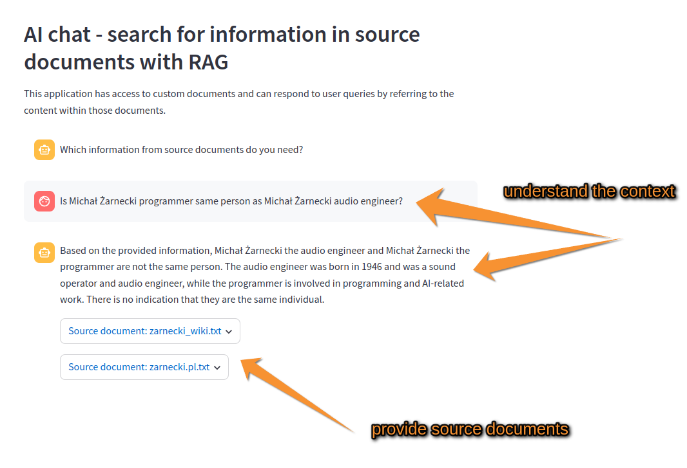

# chatbot based on language model with access to source documents 

LLM (Large Language Model) based chatbot using RAG (Retrieval-augmented generation) and langchain.
Chatbot has access to trade register documents related to Ticos Systems company and is able to answer any question related to this company not only giving answer but also referencing the source document.

as language model OpenAI GPT-4o was used
to run chat in browser streamlit library was used

## Usage
1. before run install needed libraries as below:
`pip install -r requirements.txt`

2. create .env file with hugiingface token environment variable 
`HUGGINGFACEHUB_API_TOKEN="your_token_from_huggingface.com"`
`OPENAI_API_KEY="your_token_from_openai"`

3. run script with command:
`streamlit run index.py`

To run it for your purpose you can replace source documents in /data dir and prompt in index.py.

this project was originally based on https://github.com/shashankdeshpande/langchain-chatbot